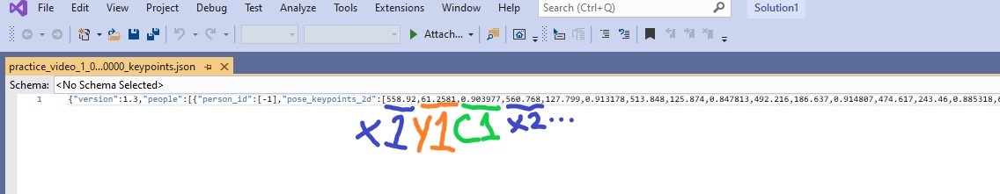
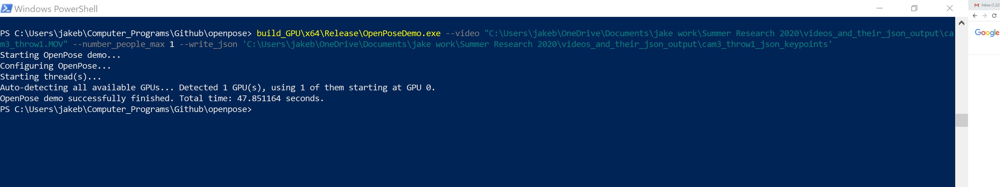

# Analyzing-Pitching-Kinematics-with-Openpose
PLNU Summer Research 2020 - Analyzing Pitching Kinematics with Openpose

## Overview:
Hi! This document is a brief overview of what I have learned/coded/attempted over the course of my Summer Research. 

To summarize, by using OpenPose, an open-source software package, as well as some of my own python code, I have been able to analyze video of pitchers and gain some significant insights.

In this github repo, I have included this guide, my .ipynb program, and a few documents on how to replicate my work.

#### Notice on 3D Reconstruction:
I spent a lot of time trying to figure out the installation of Openpose so that I could use its 3D reconstruction capabilities. Unfortunately, I was not able to figure out how to correctly set up Openpose’s 3D reconstruction module. So, as a result of not figuring out how to do 3D reconstruction, I simply chose to just stick to analyzing 2D videos. 

## Description of Program:
My Program, ***“json_keypoint_analysis_multi_video”***, works best with multi-angle videos of a pitcher throwing a ball. 

But, it's not limited to just those motions, or even being the same person in each video! It can get measurements on practically any movement.

The program takes in a folder containing multiple videos that have already been processed by OpenPose. 

### Here is what the Openpose software does: 
1. The Openpose software first examines the video to find where the subject is in each frame. 

1. Then, it estimates where, and in what position the subject’s skeleton would be in that frame.

1. Then, Openpose outputs a series of text-based .JSON files, where each file represents one frame, and contains the x,y position and confidence level of each keypoint used to build the skeleton.

#### Here is an example of one .JSON file and how it is organized.

### Here is what my program does with the OpenPose output:
1. Set up the variables necessary for calculations by asking the user

1. Read in the .JSON files from the user-specified folder to create ***Position*** dataframes for each video

1. Use the Position dataframes to calculate a ***Velocity*** dataframe for each video

1. Use the Velocity dataframes to calculate an ***Acceleration*** dataframe for each video

1. Use values from all of the dataframes to form a ***Throwing Arm*** dataframe

1. Calculate the angle of the throwing arm for each frame

1. Plot the results in meaningful ways

## How to use my program (with pictures!):
1. First, install Openpose and get it working. Check out the file ***“Openpose & Ubuntu Install”***, it contains the Instructions on how to set up Openpose and build it with CMake and Visual Studio 2019. It also contains links to the OpenPose Github and to a video tutorial.

1. Once you have Openpose all set up, go to the **Windows Powershell Prompt**, the keyboard shortcut is *the windows sign + x + a*. (This is for Windows systems only, other systems will have to look on the OpenPose Github under openpose/doc/installation.md for instructions)

1. In the Windows Powershell Prompt, navigate to the directory where you have openpose set up. Look up online on how to change directories if you don’t know how to.

1. When you set up Openpose with CMake, you generated a “build” file. Copy the command in the picture below, but with some changes

   1. Where the command says ***“build_GPU”***, change it to whatever your build file is named
   
   1. Where it says ***“--video “C:\Users…” “***, change the path to wherever you have  your raw video stored
   
      1. To get the path to the video easily, navigate to the file location in File Explorer, and click on **“Copy Path”**, then paste the path
      
   1. Where it says ***“--write_json  ‘C:\Users…’ “***, change the path to the location where you want to save the .JSON output folder, and at the end have it be the name you want the folder to be saved as
 

 
1. Now that you have the right command, press the Enter key and run the program

   1. If you want to run your program using a Graphics Card or eGPU, the setup for that configuration is specified in the ***“Openpose & Ubuntu Install”*** file.
   
1. Run that command, with the proper arguments, for every video you want to be processed.

1. Once you have processed all of your videos through openpose, you are ready to work with the main program. 

1. Open “openpose_keypoint_analysis_multi_video.ipynb”  in Jupyter notebooks

   1. If you do not have Jupyter notebooks installed, I have a guide on how to set it up through Anaconda.

## Some ways that my program can be improved:
1. Find ways to better handle “0” values or extreme values from Openpose

   1. “0” values happens when a certain part of the body is obscured from view for a camera angle
   
   1.Extreme values happen sometimes when openpose does not identify the subject’s skeleton correctly in some frames
   
      1. Velocity and Acceleration would be calculated more smoothly by averaging the values of the frames before it and after it, instead of setting it equal to its own calculation *(although this would make the first and last frames unusable)*
      
1. Find more relationships in the data between the throwing arm angle and velocity of the arm through the video

  1. When angle changes most, how does the velocity change?
  
1. Try to identify the 6 stages of Pitching a Ball in the data for each video

   1. The 6 Phases are: 
      * Wind up 
      * Stride 
      * Cocking 
      * Acceleration 
      * Deceleration 
      * Follow Through 
      
1. Try to input videos of one pitcher doing multiple pitches from one angle

   1. Then you would be able to measure the consistency of pitching
   
      1. You could make a dataframe for the pitcher’s average and measure successive pitches against it
      
         1. What is the standard deviation of velocity and angle
         
         1. Flag pitches that are outliers for review
         
      1. How does the pitcher’s pitch change when he is tired?

1. Maybe put the code in a .py file for easier 1-click processing, instead of a jupyter notebook

1. Another useful measurement: Stride ankle distance 

   1. It is important that the stride ankle lands at a distance of approximately 87% of the pitcher’s height away from the other leg, changes in this distance affect the stress levels on the shoulders during a pitch.
   
      1. Source: https://www.physio-pedia.com/Throwing_Biomechanics#cite_note-Baseball_Biomechanics-10
      
   1. Maybe this would be another good measurement to obtain from the position dataframes

